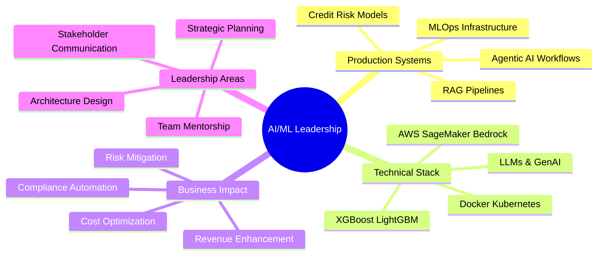
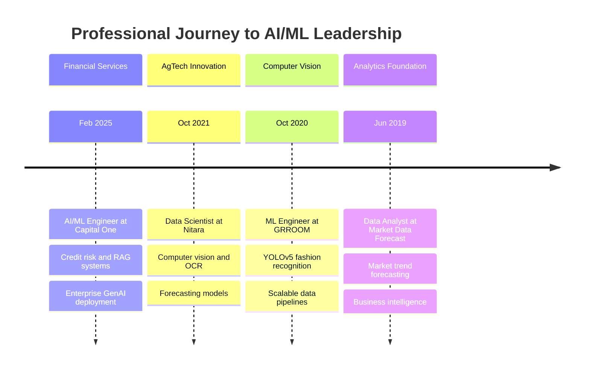

---

## 🎯 EXECUTIVE SUMMARY

**AI/ML Engineering Leader** driving enterprise transformation through strategic implementation of machine learning, retrieval-augmented generation systems, and production-grade AI infrastructure. With 5+ years of progressive experience across **financial services, healthcare, and agricultural technology**, I architect end-to-end AI solutions that deliver measurable business impact while maintaining regulatory compliance and operational excellence.

My leadership philosophy centers on **building intelligent systems that solve real business problems**—from credit risk models processing 100K+ scoring records at Capital One to OCR solutions achieving 96% accuracy across 60,000+ images in agricultural operations. I bridge the gap between cutting-edge AI research and production deployment, ensuring every model serves a strategic business objective.

### 📊 LEADERSHIP & IMPACT DASHBOARD

| **Metric** | **Impact** | **Domain** |
|:-----------|:-----------|:-----------|
| **Production Models Deployed** | Enterprise-grade systems | Credit Risk, RAG, Computer Vision, Forecasting |
| **Data Volume Processed** | 100K+ scoring records, 60K+ images | Financial Services, Agriculture |
| **Model Accuracy Improvements** | 96% OCR accuracy, 90%+ disease detection | Healthcare, AgTech |
| **Forecasting Enhancement** | 18% improvement in yield prediction | Supply Chain & Operations |
| **Cost Optimization** | Automated workflows reducing manual effort | Cross-functional |
| **Technology Stack Leadership** | 56+ technologies | AWS, Azure, LLMs, MLOps |

---

## 💡 LEADERSHIP PHILOSOPHY

> **"Strategic AI implementation is not about deploying the latest models—it's about architecting systems that align with business objectives, scale with organizational growth, and maintain trust through rigorous evaluation and monitoring."**

I lead through a framework of **Technical Excellence + Business Acumen + Regulatory Awareness**:

- **Strategic Alignment**: Every AI initiative maps directly to revenue impact, cost reduction, or risk mitigation
- **Production-First Mindset**: Building for scale, monitoring, and continuous improvement from day one
- **Cross-Functional Leadership**: Translating complex ML concepts into actionable business insights for C-suite stakeholders
- **Regulatory Excellence**: Implementing guardrails, explainability, and compliance frameworks in regulated industries

---

## 🏗️ STRATEGIC TECHNOLOGY ARCHITECTURE

---

## 📈 CAREER PROGRESSION & STRATEGIC GROWTH

---

## 🎖️ KEY STRATEGIC ACHIEVEMENTS

### **Financial Services Transformation (Capital One)**

**Credit Risk Model Enhancement**
- Architected XGBoost and LightGBM ensemble models evaluating **100,000+ scoring records** for lending decisions
- **Improved AUC metrics** over baseline models, directly impacting risk assessment accuracy and portfolio performance
- Deployed on **Amazon SageMaker** with full MLOps pipeline including monitoring, drift detection, and automated retraining

**Enterprise RAG System Implementation**
- Led design and deployment of production **Retrieval-Augmented Generation pipelines** using Amazon Bedrock, Llama 3, LangChain, and Pinecone
- Implemented **semantic search with cross-encoder reranking** to retrieve precise information from financial and regulatory documents
- Built comprehensive **LLM evaluation framework** with 10+ benchmark scenarios measuring retrieval quality, groundedness, hallucination detection, and response consistency

**Agentic AI Workflow Automation**
- Engineered **multi-agent systems** using Amazon Bedrock, LangChain, and AutoGen to automate compliance document classification and policy validation
- Automated compliance review workflows while maintaining regulatory standards
- Implemented **LLM guardrails and validation workflows** preventing unsafe outputs in enterprise GenAI applications

**MLOps & Production Excellence**
- Established **model monitoring infrastructure** using MLflow and Evidently AI for drift detection and performance tracking
- Deployed scalable **inference services** using Docker, Kubernetes (Amazon EKS), FastAPI, and REST APIs
- Built **production observability** with Prometheus and Grafana, supporting multiple models with consistent SLA adherence

**Business Impact**: Enhanced credit decisioning accuracy, accelerated compliance workflows, and established reusable GenAI infrastructure serving multiple business units.

---

### **Healthcare & Agricultural Innovation (Nitara)**

**Computer Vision for Agricultural Operations**
- Developed **Keras OCR + OpenCV solution** extracting donor IDs, batch codes, and expiry dates from **60,000+ artificial insemination tube images**
- Achieved **96% extraction accuracy**, significantly reducing manual data entry
- Enabled real-time inventory tracking and compliance documentation for veterinary teams

**Deep Learning Disease Detection System**
- Built **cattle disease detection model** trained on **25,000+ labeled livestock images** achieving **90%+ validation accuracy**
- Enabled early identification of health conditions, reducing treatment costs and improving herd health outcomes
- Translated model outputs into **8+ actionable business insights** for farm management and veterinary stakeholders

**Forecasting & Supply Chain Optimization**
- Developed **ARIMA-based forecasting models** using 3+ years of historical farm production data
- Improved **monthly milk yield forecasting accuracy by 18%**, supporting inventory planning and distribution decisions
- Designed **interactive Power BI dashboards** tracking cattle health, insemination success rates, and production metrics

**Business Impact**: Reduced operational costs, improved animal health outcomes, and enhanced supply chain predictability through data-driven forecasting.

---

### **Fashion Tech & Computer Vision (GRROOM)**

**YOLOv5 Fashion Recognition System**
- Developed and fine-tuned **YOLOv5 models** for automatic detection and classification of clothing items
- Enabled **personalized product recommendations** through real-time image recognition
- Built **scalable web scraping pipelines** (Scrapy, BeautifulSoup) synchronizing product catalogs from major fashion retailers

**Data Engineering & Model Operations**
- Curated and annotated **large-scale fashion image datasets** improving model robustness across diverse apparel categories
- Automated **data validation and preprocessing workflows**, reducing manual effort and improving training consistency
- Implemented continuous model retraining pipeline maintaining recommendation quality as inventory evolved

**Business Impact**: Enhanced customer personalization, improved conversion rates through accurate recommendations, and reduced time-to-market for new product integrations.

---

### **Market Intelligence & Analytics (Market Data Forecast)**

**Strategic Forecasting & Market Analysis**
- Developed **ARIMA and regression forecasting models** analyzing market trends across healthcare, agriculture, and financial sectors
- Conducted exploratory and statistical analysis identifying **5+ business trends** supporting strategic planning initiatives
- Built **interactive Power BI dashboards** visualizing competitive intelligence and demand forecasts

**Operational Excellence**
- Automated **recurring reporting workflows** using Python and Advanced Excel, streamlining monthly deliverables
- Improved reporting consistency across client engagements, reducing manual effort
- Provided data-driven insights supporting C-level strategic planning and investment decisions

**Business Impact**: Enabled data-driven decision-making for clients across multiple industries, improving forecast accuracy and strategic positioning.

---

## 🛠️ EXECUTIVE TECHNOLOGY STACK

### **AI/ML & GenAI Leadership**

**Generative AI & LLM Systems**
- **Frameworks**: LangChain, LangGraph, LangSmith, AutoGen
- **Models**: Llama 3, GPT-series, BERT, Claude
- **Vector Databases**: Pinecone, FAISS, LlamaIndex
- **Techniques**: RAG, semantic retrieval, cross-encoder reranking, prompt engineering, SFT, PEFT/LoRA, hallucination detection

**Machine Learning & Data Science**
- **Algorithms**: XGBoost, LightGBM, ARIMA, Regression, Classification
- **Libraries**: Scikit-learn, PyTorch, Keras, TensorFlow
- **Computer Vision**: YOLOv5, keras-ocr, OpenCV
- **NLP**: BERT, transformers, document chunking, embeddings

**MLOps & Production Infrastructure**
- **Cloud Platforms**: AWS (SageMaker, Bedrock, Lambda, Glue, Redshift, CloudWatch, EKS), Azure ML, Cosmos DB
- **Orchestration**: Docker, Kubernetes, Airflow, GitHub Actions
- **Monitoring**: MLflow, Evidently AI, Prometheus, Grafana
- **APIs**: FastAPI, REST, microservices architecture

**Data Engineering & Analytics**
- **Languages**: Python, SQL, PySpark
- **Big Data**: Hadoop, Hive, Spark
- **Databases**: Redshift, Cosmos DB, Pinecone
- **Visualization**: Power BI, Grafana
- **ETL**: Airflow, AWS Glue, Scrapy, BeautifulSoup

---

## 🚀 FEATURED STRATEGIC PROJECTS

### **1. Enterprise RAG System for Financial Compliance**

**Strategic Challenge**: Capital One needed intelligent document retrieval across thousands of financial and regulatory documents to accelerate compliance workflows and risk analysis.

**Technical Solution**:
- Architected production RAG pipeline using **Amazon Bedrock, Llama 3, LangChain, and Pinecone**
- Implemented **semantic search with cross-encoder reranking** for precision retrieval
- Built **comprehensive evaluation framework** with 10+ benchmark scenarios
- Deployed **LLM guardrails** preventing unsafe and non-grounded outputs

**Business Impact**:
- Automated compliance document review workflows
- Improved answer accuracy and groundedness through multi-stage retrieval
- Established reusable GenAI infrastructure serving multiple business units
- Maintained regulatory compliance through robust validation workflows

**Technologies**: Amazon Bedrock, Llama 3, LangChain, Pinecone, Python, FastAPI, Docker, Kubernetes

---

### **2. Credit Risk Scoring Model Enhancement**

**Strategic Challenge**: Improve credit decisioning accuracy for lending portfolio while maintaining model explainability and regulatory compliance.

**Technical Solution**:
- Developed **XGBoost and LightGBM ensemble models** evaluating **100,000+ scoring records**
- Implemented **Amazon SageMaker MLOps pipeline** with automated monitoring and retraining
- Built **drift detection system** using MLflow and Evidently AI
- Deployed scalable **inference services** with Kubernetes and FastAPI

**Business Impact**:
- **Improved AUC metrics** over baseline models, enhancing risk assessment accuracy
- Reduced model deployment time through automated MLOps workflows
- Deployed scoring as scalable inference services
- Maintained model performance through continuous monitoring and drift detection

**Technologies**: XGBoost, LightGBM, Python, Amazon SageMaker, MLflow, Evidently AI, Docker, Kubernetes

---

### **3. Medical Chatbot with RAG Architecture**

**Strategic Challenge**: Build intelligent healthcare information system providing accurate, grounded medical guidance from trusted sources.

**Technical Solution**:
- Developed **end-to-end RAG pipeline** for medical document retrieval
- Implemented **semantic chunking and embedding strategies** for medical literature
- Built **Flask-based web interface** with conversational UI
- Deployed on **AWS infrastructure** with scalable backend

**Business Impact**:
- Provided accurate medical information retrieval from trusted sources
- Demonstrated RAG architecture patterns applicable across healthcare domains
- Showcased production deployment best practices for LLM applications

**Technologies**: LangChain, Pinecone, Flask, AWS, Python, HTML/CSS

**GitHub**: [medical-chatbot](https://github.com/saikirankoppichetti/medical-chatbot)

---

### **4. Agricultural Computer Vision System**

**Strategic Challenge**: Automate data extraction from 60,000+ artificial insemination tube images to eliminate manual entry and improve operational efficiency.

**Technical Solution**:
- Developed **Keras OCR + OpenCV pipeline** for text extraction
- Implemented **image preprocessing and validation workflows**
- Built **automated data pipeline** integrating with farm management systems
- Designed **Power BI dashboards** for operational monitoring

**Business Impact**:
- Achieved **96% extraction accuracy** across 60,000+ images
- Reduced manual data entry through automation
- Enabled real-time inventory tracking and compliance documentation
- Improved data quality and eliminated manual transcription errors

**Technologies**: Keras OCR, OpenCV, Python, Power BI

---

## 📚 TECHNICAL THOUGHT LEADERSHIP

### **Areas of Expertise**

**Retrieval-Augmented Generation (RAG)**
- Production RAG architectures for enterprise applications
- Semantic retrieval, cross-encoder reranking, and hybrid search
- Document chunking strategies and embedding optimization
- Hallucination detection and groundedness evaluation

**Agentic AI & Multi-Agent Systems**
- LangGraph and AutoGen workflow orchestration
- Tool-calling and function integration patterns
- Multi-agent collaboration for complex workflows
- Production deployment and monitoring strategies

**MLOps & Model Governance**
- End-to-end ML pipelines on AWS SageMaker and Azure ML
- Model monitoring, drift detection, and automated retraining
- A/B testing frameworks and experimentation platforms
- Compliance, explainability, and bias detection

**Computer Vision & Document AI**
- Object detection with YOLO architectures
- OCR and document understanding systems
- Image preprocessing and augmentation strategies
- Production deployment at scale

---

## 🎓 EDUCATION & CONTINUOUS LEARNING

**Master of Information Systems**  
*Cleveland State University* | Jan 2023 - Dec 2024

**Focus Areas